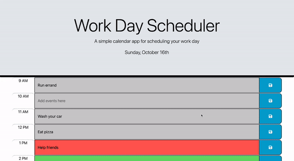

# Scheduler

## Deployed Website

[Scheduler](https://yeezyhub.github.io/Scheduler/)

## Description

&nbsp;&nbsp;&nbsp;&nbsp;&nbsp;&nbsp;Nowadays, time is more valuable than the money. A lot of people struggle with time management and planning of the tasks throughout the day. Because of this concern, I've created a scheduler that can help people to remind and keep track of their tasks in a day. Also, my knowledge of JQuery is used in this project.

## Usage

&nbsp;&nbsp;&nbsp;&nbsp;&nbsp;&nbsp;Simply click any time of the day to input your plan for today. As a reminder, gray areas correspond to the past time, red is the present and green is the future. After inputing the tasks, click 'Save' icon on the right and your tasks are saved to your system, even though you refresh the page it will be still there waiting for you to complete.

## Credits

My Github Profile: [yeezyhub](https://github.com/yeezyhub)

## License

Please refer to the LICENSE in the repo.
